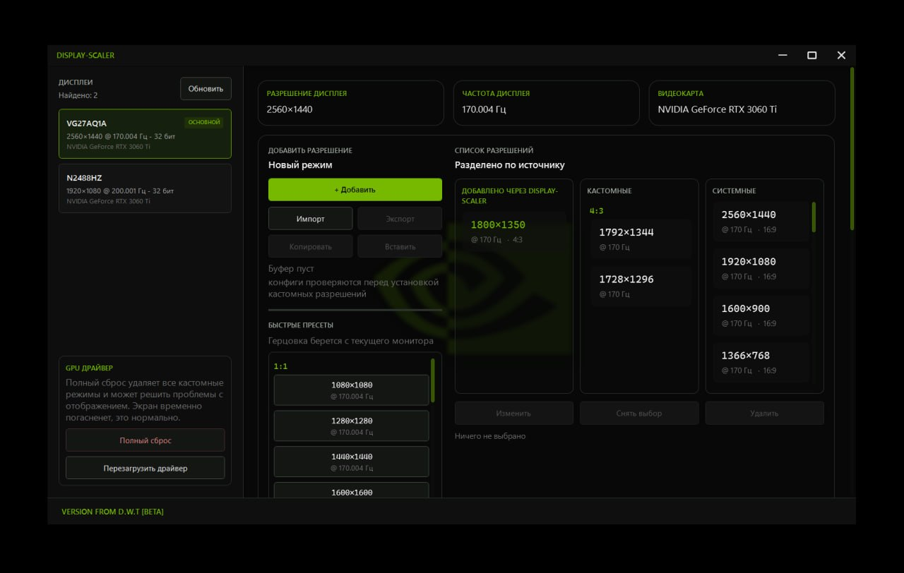
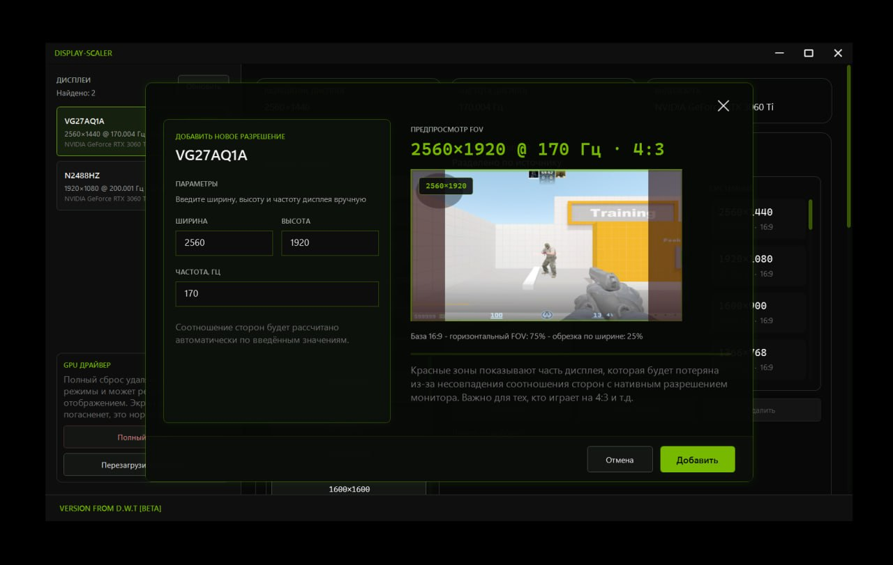
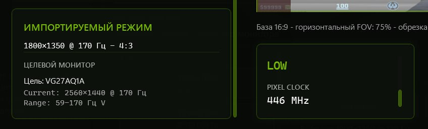
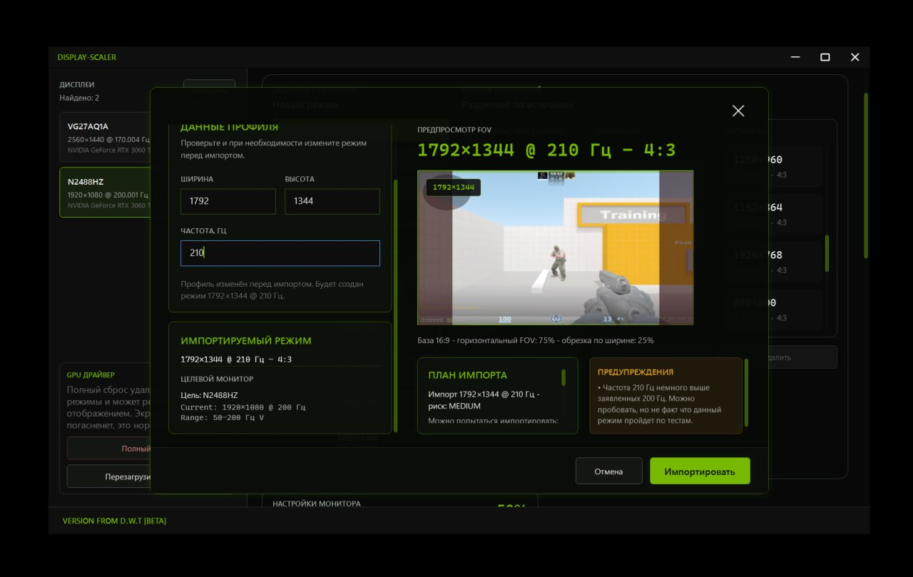

# DISPLAY-SCALER

DISPLAY-SCALER is a Windows utility for creating, validating, importing, and transferring custom display resolutions across multi-monitor setups.

## Features

- Create, edit, and remove custom display modes by width, height, and refresh rate.
- Select a display, view its current settings, and copy a mode to another display with a compatibility check.
- Preview the estimated visible-area change relative to 16:9 based on aspect ratio. Actual FOV behavior depends on the game.
- Use quick presets for 1:1, 4:3, and 16:10 aspect ratios, with refresh rate adapted to the selected display.
- Import and export CRU/EDID `.bin` files and import legacy or portable DISPLAY-SCALER profiles.
- Validate imported modes before applying them: resolution, refresh rate, color bit depth, EDID limits, and Pixel Clock. Edit mode parameters before installation.
- Apply modes with a confirmation timer and automatic rollback if a mode is rejected or not confirmed.
- Distinguish DISPLAY-SCALER modes from other custom and system modes, and detect duplicate modes.
- Change refresh rate and color bit depth, and manage display saturation where supported.
- Reset custom modes, restart the display driver, and write diagnostic logs.

Some operations use NVIDIA NVAPI. Feature availability depends on the GPU, driver, and monitor. A mode accepted by validation may still be unsupported by a particular game.

## Screenshots

| Main window | Custom resolution and FOV preview |
| --- | --- |
|  |  |

| Import validation | EDID profile import |
| --- | --- |
|  |  |

## Build

- Windows x64
- .NET Framework 4.8 Developer Pack
- Visual Studio with the .NET desktop development workload

Open `DISPLAY-SCALER.sln`, select `Release` and `x64`, then build the solution.

The application project is in the `DISPLAY-SCALER` directory.